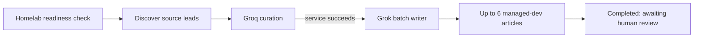

# Bloxodes Homelab Content Pipeline

This runbook describes the personal Linux homelab used for Bloxodes content automation and release work. Read it before inspecting, configuring, or repairing that machine. Never copy secret values into documentation, logs, commits, prompts, or issue comments.

Last live-state review: **2026-08-10 (IST)**.

## What The Homelab Is For

The homelab is a persistent Bloxodes workstation, separate from the production VPS. It can:

- discover article leads and curate them with Groq;
- write approved managed-dev queue topics with Grok and article workflow skills;
- retain `brief.md`, `final.json`, and other generated artifacts in its checkout;
- run local validation and browser checks;
- commit and push approved repository changes through GitHub;
- run an explicit production release when the user separately authorizes that release and the required production credentials are available.

Scheduled discovery or writing is **not** permission to publish. Production database writes, Git pushes, deployments, and queue transitions to `published` still require the normal skill safeguards and explicit human approval.

## Live Topology

| Item | Current value |
| --- | --- |
| Host | Personal Ubuntu homelab, reachable over the SSH target stored in local `.env.homelab` |
| Login user | `teja` |
| Timezone | `Asia/Kolkata`; NTP enabled |
| Canonical repository | `/home/teja/projects/Bloxodes` |
| Production website/VPS | Separate infrastructure; do not treat the homelab as the production host |
| Development database | Managed-dev Supabase used for discovery, curation, queue state, drafts, previews, and media |
| Production access during automation | Public editorial inventory only; unattended Grok must not receive production write credentials |
| Git remote | `git@github.com:RaviTejaKNTS/Bloxodes.git` |

Do not use `/srv/data/bloxodes-article-worker/current` as the active checkout. That is an obsolete path still referenced by an older installer script.

## Finding And Accessing The Host

From the owner's Mac checkout, `.env.homelab` is the local-only connection inventory. It is gitignored and contains variables such as:

```text
HOMELAB_SSH_HOST
HOMELAB_SSH_USER
HOMELAB_SSH_TARGET
HOMELAB_REPO_ROOT
HOMELAB_ARTICLE_ENV_PATH
HOMELAB_SUDO_PASSWORD
```

Load it without printing values:

```bash
set -a
source .env.homelab
set +a
ssh -o BatchMode=yes "$HOMELAB_SSH_TARGET" 'hostname; date; pwd'
```

Safety rules:

- Never display `.env.homelab`, interpolate its secret values into chat, or commit it.
- Use `$HOMELAB_REPO_ROOT` rather than duplicating the path in automation written on the Mac.
- Prefer ordinary SSH commands. Copy only exact approved artifacts; never recursively synchronize the checkout, `.env*`, `.grok`, `.config/gh`, or `node_modules`.
- Resolve targets with read-only commands before changing services, files, branches, or credentials.

The active Wi-Fi profile is configured with autoconnect, and Tailscale provides the private network path. Check both when the host is unreachable:

```bash
nmcli -t -f NAME,TYPE,AUTOCONNECT connection show --active
systemctl status NetworkManager tailscaled --no-pager
```

## Repository And GitHub

The canonical homelab checkout uses:

```text
/home/teja/projects/Bloxodes
```

Git access is intentionally repository-scoped:

- the repository remote uses SSH;
- the private deploy key is `~/.ssh/bloxodes_deploy_ed25519` with mode `0600`;
- the matching GitHub deploy key is named `Bloxodes Homelab Release Key` and has write access only to Bloxodes;
- this checkout's `core.sshCommand` selects that key with `IdentitiesOnly=yes`;
- GitHub CLI is installed and authenticated as `RaviTejaKNTS`;
- `~/.config/gh/hosts.yml` must remain mode `0600`.

Non-mutating verification:

```bash
cd /home/teja/projects/Bloxodes
git remote -v
git config --get core.sshCommand
git fetch --prune origin
gh auth status
gh repo view RaviTejaKNTS/Bloxodes --json nameWithOwner,defaultBranchRef,viewerPermission
git push --dry-run origin "HEAD:refs/heads/$(git branch --show-current)"
```

The final command must include `--dry-run` during setup checks. Never use a real push merely to test credentials.

Before changing the checkout:

```bash
git status --short --branch
git log --oneline --decorate -5
```

Preserve unrelated work. Do not reset, clean, force-push, or replace another workflow's branch. Use the normal `bloxodes-release-e2e` safeguards only when the user explicitly requests an end-to-end production release.

### Two-device production synchronization

GitHub `production` is the only shared source of truth. The canonical Mac checkout and `/home/teja/projects/Bloxodes` on the homelab should both rest on `production`, track `origin/production`, fetch all remote branches, and use:

```bash
git config pull.ff only
git config fetch.prune true
```

Use one writer device at a time:

1. On the device that will work, require a clean tracked worktree, switch to `production`, fetch, and run `git pull --ff-only origin production` before editing.
2. Prepare and validate the exact content or code scope. Scheduled article jobs may keep ignored workspace artifacts locally, but approved repository-owned content must be committed before it can move between devices.
3. Immediately before release, fetch again. Push only a normal fast-forward update to `origin/production`; never force-push.
4. On the other device, require a clean tracked worktree and run `git pull --ff-only origin production`. Verify that `HEAD` equals `origin/production` before starting its next job.
5. If a push is rejected or a fast-forward pull fails, stop. Preserve the local commit on a clearly named safety branch and reconcile it against the latest GitHub `production`; do not create a merge commit, reset, clean, copy the whole checkout, or overwrite either device.

Do not edit tracked files concurrently on both devices. A successful GitHub push is the handoff signal; the receiving device pulls only after that push completes. Database rows and Storage objects are not synchronized by Git and must continue through their page-type release workflow.

## Credentials And Data Boundaries

The systemd jobs load:

```text
/etc/bloxodes/article-automation.env
```

Required ownership and permissions are currently:

```text
0640 root:teja /etc/bloxodes/article-automation.env
```

The file contains configuration for these names; values must never be printed:

```text
ARTICLE_DEV_SUPABASE_URL
ARTICLE_DEV_SUPABASE_SERVICE_ROLE
ARTICLE_PRODUCTION_INVENTORY_URL
GROQ_API_KEY
ARTICLE_CURATION_MODEL
ARTICLE_WRITER_GROK_BIN
ARTICLE_WRITER_GROK_MODEL
ARTICLE_WRITER_BATCH_SIZE
ARTICLE_WRITER_MAX_ATTEMPTS
ARTICLE_WRITER_TIMEOUT_MINUTES
SUPABASE_MEDIA_BUCKET
SUPABASE_MEDIA_PUBLIC_URL
```

The repository itself currently has no `.env` or `.env.local` on the homelab. Do not assume production database credentials exist merely because Git pushes work.

Keep the boundary explicit:

- managed-dev credentials may be available to discovery, curation, writing, and preview commands;
- unattended Grok should receive only managed-dev credentials and public production inventory access;
- production database credentials should be introduced only for an explicitly approved release, ideally through a separate root-owned env file rather than the workspace;
- never overwrite managed-dev variables with production values;
- never pass production service-role credentials into the Grok child process;
- GitHub credentials authorize repository operations, not production database publication.

Grok authentication belongs to the `teja` user and should be completed interactively on the homelab. Do not copy its private auth files into the repository.

## Scheduled Article Pipeline

The live systemd timer is:

```text
bloxodes-article-discovery.timer
```

It runs four times daily in IST:

```text
00:00
06:00
12:00
18:00
```

`Persistent=true` allows a missed run to start after the machine returns. The service sequence is:



The discovery unit executes, in order:

```bash
npm run articles:homelab:check -- --component discovery
npm run articles:discover -- --apply
npm run articles:curate -- --apply
```

Discovery applies one uniform 18-hour freshness window to every publisher; the CLI refuses windows of 24 hours or more. Its journal includes a per-source funnel table, so a source that is reachable but stale is distinguishable from a broken parser or a feed with missing dates. Eligible pages are fetched directly for bounded headings and source text; Firecrawl or another paid crawler is not involved. Repeated source URLs refresh the existing provenance row instead of being permanently discarded.

Curation claims at most 12 candidates per scheduled run by default, sends the source evidence plus only intent-matched production inventory rows to Groq, and scales the response token budget with that batch to avoid unnecessary free-tier TPM failures. A patch-note or update lead may yield several distinct source-backed guide/explainer angles, while multiple publishers covering one interchangeable player task merge into one topic key. Prompt-version changes selectively revisit prior weak/evidence/overlap rejects and retryable skipped/failed results. Deliberate codes, collection, and event decisions stay closed. Three consecutive current-prompt runs with zero approved topics produce a degraded non-zero service result instead of looking healthy.

During writing, missing exact per-item tier-list images no longer forces an editorial skip: the tier-list writer uses a complete visual layout when every exact local asset exists and a verified text/table-first layout otherwise. Temporary evidence, tool, browser, media, or service failures use `blocked` with backoff; the batch requeues due blocked rows while they remain under `ARTICLE_WRITER_MAX_ATTEMPTS`. A non-empty Grok batch that exits without completing any managed-dev article returns a degraded non-zero result for systemd visibility.

Only a fully successful discovery service triggers `bloxodes-article-writer.service` through `OnSuccess=`. The writer unit is configured to run:

```bash
npm run articles:homelab:check -- --component writer
npm run articles:writer:batch -- --apply --limit 6
```

The writer is a oneshot service with a 5.5-hour timeout, `MemoryHigh=5G`, and `MemoryMax=6G`. It is not a continuously running daemon.

## Mandatory Health Checks

Never infer health from an enabled timer. Check the last service exits and logs:

```bash
systemctl list-timers --all --no-pager | grep bloxodes
systemctl status bloxodes-article-discovery.service --no-pager
systemctl status bloxodes-article-writer.service --no-pager
journalctl -u bloxodes-article-discovery.service --since today --no-pager
journalctl -u bloxodes-article-writer.service --since today --no-pager
```

Run repository preflights as `teja` from the canonical checkout:

```bash
cd /home/teja/projects/Bloxodes
npm run articles:homelab:check -- --component discovery
npm run articles:homelab:check -- --component writer
```

Before enabling or manually starting the writer, confirm every command named by its unit exists in the checked-out `package.json`:

```bash
npm run | grep -E 'articles:(homelab|discover|curate|writer)'
```

### Known Drift At Last Review

As of 2026-08-10:

- `scripts/ops/install-homelab-article-automation.sh` still requires the obsolete `/srv/data/bloxodes-article-worker/current` path and describes separate discovery/writer timers. Do **not** rerun it unchanged against the live `/home/teja/projects/Bloxodes` setup.
- The live writer unit calls `articles:writer:batch`, but that alias is absent from the currently checked-out homelab `package.json`. Repair and verify that mismatch before treating automatic writing as operational.
- The 06:00 discovery run reached curation but exited nonzero, so `OnSuccess=` did not start the writer. Inspect the journal for the real error; do not bypass curation by starting writing on unapproved discovery candidates.

These are observed state notes, not permission to change the machine automatically. Reinspect first because the state may have changed.

## Safe Manual Runs

After preflight succeeds, systemd can run one component with its protected environment:

```bash
sudo systemctl start bloxodes-article-discovery.service
sudo systemctl start bloxodes-article-writer.service
```

Watch the exact unit rather than repeatedly starting it:

```bash
systemctl status bloxodes-article-writer.service --no-pager
journalctl -fu bloxodes-article-writer.service
```

Starting discovery may trigger the writer automatically when discovery and curation succeed. Do not manually start both at the same time.

## Review And Production Release

Article automation ends at managed-dev `completed`. Human review owns the next step:

1. Use `bloxodes-article-release-review` to list completed rows and preview them against managed-dev Supabase.
2. Publish or reject only the exact items explicitly selected by the user.
3. Resolve only the selected homelab `result_path` and article media. Never copy unrelated artifacts.
4. Follow `bloxodes-release-e2e` safeguards for an explicitly authorized production release.
5. Publish required code/media first, then production database rows.
6. Verify the production row, canonical media, exact live URL, and sitemap entry.
7. Only then mark the managed-dev queue row `published`.

For collections, wikis, tools, or other content families, use their page-type workflow and release skills. GitHub authentication makes a release possible; it does not replace page-specific QA or human approval.

Automated article author selection must go through `scripts/shared/article-author-selection.ts`. It excludes the production `ravi-teja-knts` author and chooses among the remaining eligible authors. Do not bypass that helper with a hard-coded fallback ID.

## Updating Or Reconfiguring The Homelab

When the user asks to configure or repair the homelab:

1. Read this document and the closest repository `AGENTS.md` files.
2. Inspect live paths, branch/status, unit definitions, timers, tool versions, and env-file permissions without printing secrets.
3. State the exact intended change and preserve unrelated repository work.
4. Prefer committed repository scripts and unit templates over one-off commands, but compare templates with live units first.
5. Use Git to synchronize code. Use exact-path copy only for generated artifacts that are intentionally not committed.
6. Run `npm install`/`npm ci` only when the lockfile and checkout require it.
7. Run the relevant homelab preflight before starting services.
8. After unit changes, run `systemctl daemon-reload`, inspect `systemctl cat`, and manually execute one observed run before enabling a timer.
9. Verify Git fetch and a push dry-run after credential changes. Never perform a real push without release authority.
10. Report what changed, what remains intentionally unauthenticated or unavailable, and the exact verification evidence.

Do not silently broaden production access, expose secrets to an agent subprocess, move the canonical checkout, or enable a new scheduled job merely because the host is trusted.

## Quick Diagnostic Receipt

A useful status report includes:

```text
host/timezone
canonical checkout and current branch/commit
clean or dirty Git state
origin transport and gh auth status
timer next/last trigger
discovery and writer last exit
preflight result for each component
managed-dev reachability
Grok and browser availability
env-file ownership/mode (never values)
Wi-Fi/Tailscale state
known blockers and whether any production mutation occurred
```
